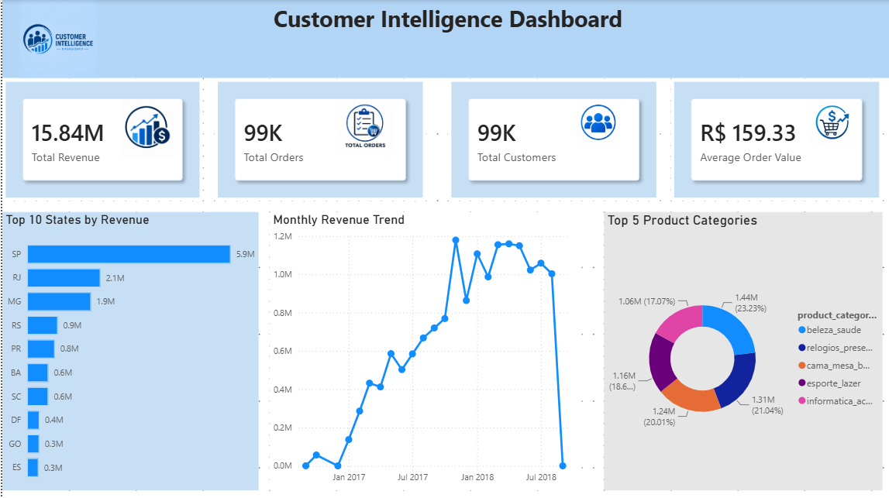

# Customer Intelligence Analytics

An end-to-end data analytics project analyzing e-commerce customer behavior, revenue, and purchasing patterns.

## Project Objective
The goal is to identify valuable customers, understand sales performance, segment customers, and explore customer purchase behavior using data.

## Tools Used
- SQL – data analysis and business queries
- Python (Pandas) – data cleaning, analysis and RFM
- Power BI – interactive dashboard and business insights
- Machine Learning – customer purchase prediction

## Key Analysis
- Revenue and order trends
- Top customers and product categories
- Customer distribution by state
- RFM customer segmentation
- Customer lifetime value analysis
- Purchase prediction using customer behavior

## Dashboard
The Power BI dashboard provides an overview of revenue, orders, customers, product performance and customer segments.
### Dashboard Overview

## Files
- `Customer_analysis.sql` – SQL analysis
- `analysis.py` – Python customer analysis
- `ml_prediction.py` – ML prediction workflow
- `Customer_Intelligence_Dashboard.pbix` – Power BI dashboard
